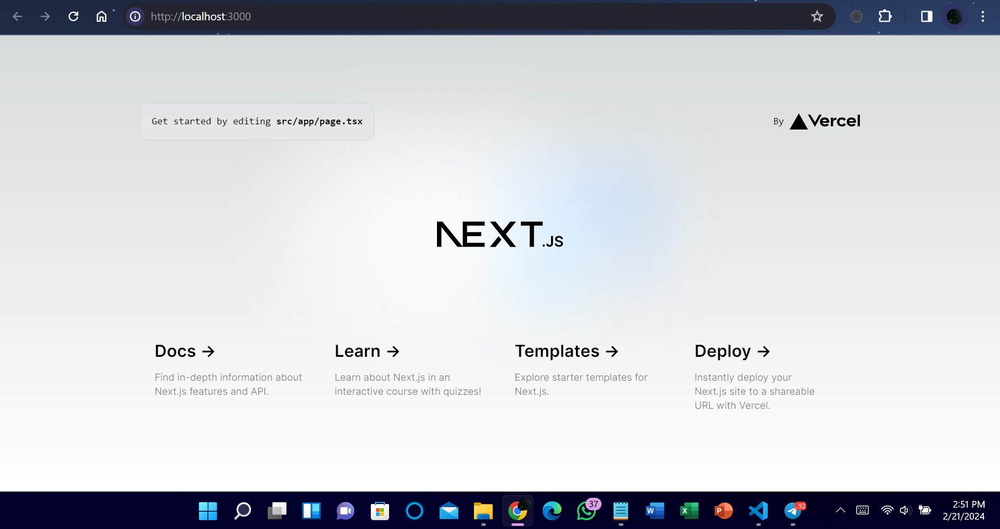
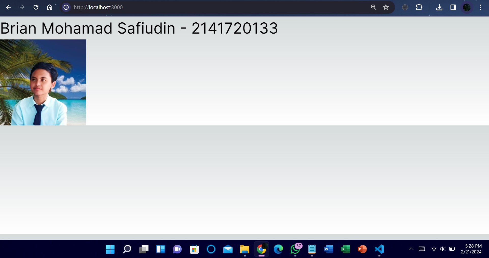

# Praktikum: Membuat Project Pertama ReactJS

### Nama : Brian Mohamad Safiudin
### NIM : 2141720133
### Kelas : TI-3F

## Langkah 1 - 2
#### Buatlah folder baru bernama belajar-react lalu di dalam folder tersebut, buatlah project baru bernama hello-world


## Soal 1
#### Pada gambar tersebut, silakan Anda browsing apa yang dimaksud dengan:

```bash
TypeScript
ESLint
Tailwind CSS
App Router
Importalias
```

- `TypeScript:`
TypeScript adalah sebuah bahasa pemrograman open-source yang dikembangkan oleh Microsoft. Ini adalah sebuah super-set dari JavaScript yang menambahkan static typing (pengetikan statis) ke dalam bahasa tersebut. Dengan menggunakan TypeScript, pengembang dapat menentukan tipe data untuk variabel, parameter fungsi, dan nilai kembali fungsi, yang membantu dalam mendeteksi kesalahan lebih awal dalam siklus pengembangan dan meningkatkan keamanan dan keandalan kode.

- `ESLint:`
ESLint adalah utilitas linting untuk JavaScript. Ini membantu dalam mengidentifikasi dan memperbaiki pola kode yang tidak sesuai dengan pedoman atau standar penulisan yang ditetapkan. Dengan menggunakan ESLint, tim pengembangan dapat memastikan bahwa kode JavaScript mereka konsisten, mudah dibaca, dan mematuhi praktik terbaik.

- `Tailwind CSS:`
Tailwind CSS adalah sebuah framework CSS yang memungkinkan pengembang untuk mendesain tata letak web dengan cepat menggunakan kelas-kelas bawaan. Berbeda dengan framework CSS tradisional yang menyediakan komponen-komponen siap pakai, Tailwind CSS fokus pada utility-first approach, yang berarti pengembang membangun desain mereka dengan menggabungkan kelas-kelas utilitas yang telah ditetapkan.

- `App Router:`
App Router (atau sering disebut sebagai aplikasi router) adalah bagian dari framework atau perpustakaan yang mengatur rute (routing) di dalam aplikasi web atau aplikasi berbasis web. Ini memungkinkan navigasi antara halaman-halaman atau tampilan-tampilan yang berbeda dalam aplikasi tanpa harus memuat ulang halaman utama.

- `Import alias:`
Import alias adalah cara untuk membuat alias atau nama singkat untuk modul atau berkas yang diimpor di dalam sebuah skrip JavaScript atau TypeScript. Ini membantu dalam meningkatkan keterbacaan dan pemeliharaan kode dengan menggantikan path panjang atau kompleks dengan nama yang lebih singkat atau deskriptif saat mengimpor modul atau berkas tersebut. Misalnya, daripada menuliskan import ModuleName from '../../some/long/path/ModuleName';, dapat menggunakan alias seperti import ModuleName from '@/components/ModuleName';, dengan @ sebagai penunjuk direktori root aplikasi.

## Langkah 3
#### Setelah selesai proses langkah sebelumnya, ketik per baris di terminal seperti berikut untuk masuk ke folder project dan dibuka dengan VS Code. Maka VS Code akan membuka project react Anda yang telah dibuat bernama hello-world.
```bash
cd hello-world
```
```bash
code . 
```


## Soal 2
#### Pada struktur project tersebut, jelaskan kegunaan folder dan file masing-masing tersebut!


- `node_modules:` Folder ini berisi semua paket dan dependensi yang diperlukan oleh proyek React. Ketika menggunakan npm (Node Package Manager) atau Yarn untuk mengelola dependensi proyek, paket-paket ini akan diunduh dan disimpan di folder node_modules. Ini termasuk pustaka-pustaka pihak ketiga yang digunakan dalam proyek React, seperti React itu sendiri, React Router, Redux, dll.

- `public:` Folder ini berisi file-file statis yang akan disajikan langsung oleh server web. Misalnya, file index.html, favicon.ico, dan gambar-gambar statis lainnya dapat ditempatkan di sini. File index.html adalah titik awal dari aplikasi React dan biasanya berisi elemen root tempat React akan di-mount.

- `src:` Folder ini adalah tempat utama di mana kode sumber aplikasi React berada. Ini biasanya berisi file-file JavaScript dan komponen React yang merupakan bagian inti dari aplikasi. Struktur di dalam folder src dapat bervariasi tergantung pada kompleksitas dan organisasi proyek.

- `.eslintrc.json:` Berkas ini adalah berkas konfigurasi yang digunakan oleh ESLint, sebuah utilitas linting untuk JavaScript. Ini berisi preferensi dan aturan yang digunakan oleh ESLint saat memeriksa kode sumber, seperti aturan penulisan, aturan kualitas, dan aturan lainnya.

- `.gitignore:` Berkas ini adalah berkas konfigurasi yang digunakan oleh Git untuk menentukan file dan folder mana yang harus diabaikan saat melakukan operasi Git, seperti git add, git commit, dan git push. Ini biasanya berisi daftar file dan folder yang dihasilkan secara otomatis atau tidak perlu disertakan dalam repositori Git, seperti node_modules, file konfigurasi lokal, dan file sementara.

- `next-env.dts:` Berkas ini adalah berkas yang digunakan oleh Next.js, sebuah kerangka kerja React untuk membuat aplikasi web. Ini berisi definisi tipe untuk lingkungan pengembangan Next.js, seperti variabel lingkungan, konfigurasi, dan pengaturan lainnya.

- `next.config.mjs:` Berkas ini adalah berkas konfigurasi yang digunakan oleh Next.js untuk mengonfigurasi berbagai aspek aplikasi web, seperti pengaturan server, pengaturan rute, pengaturan tata letak, dan pengaturan lainnya.

- `package-lock.json:` Berkas ini adalah berkas yang dihasilkan oleh npm untuk memastikan bahwa versi paket yang diinstal di lingkungan pengembangan lokal sesuai dengan versi paket yang diinstal di lingkungan produksi. Ini memastikan bahwa proyek akan berperilaku konsisten di berbagai lingkungan.

- `package.json:` Berkas ini adalah berkas konfigurasi proyek yang berisi informasi tentang proyek, dependensi, skrip, dan konfigurasi lainnya. Ini juga berisi daftar dependensi yang diperlukan oleh proyek, versi Node.js yang digunakan, dan skrip yang dapat dijalankan untuk memulai, menguji, atau membangun proyek.

- `package-lock.json:` Berkas ini adalah berkas yang dihasilkan oleh npm untuk memastikan bahwa versi paket yang diinstal di lingkungan pengembangan lokal sesuai dengan versi paket yang diinstal di lingkungan produksi. Ini memastikan bahwa proyek akan berperilaku konsisten di berbagai lingkungan.

- `postcss.config.js` Berkas ini adalah berkas konfigurasi yang digunakan oleh PostCSS, sebuah alat pengolahan CSS. Ini berisi preferensi dan aturan yang digunakan oleh PostCSS saat memproses dan mengonversi kode CSS, seperti aturan penulisan, aturan kualitas, dan aturan lainnya.

- `README.md:` Berkas ini adalah berkas yang berisi dokumentasi proyek.

- `tailwind.config.ts:` Berkas ini adalah berkas konfigurasi yang digunakan oleh Tailwind CSS, sebuah framework CSS. Ini berisi preferensi dan aturan yang digunakan oleh Tailwind CSS saat memproses dan mengonversi kode CSS, seperti aturan penulisan, aturan kualitas, dan aturan lainnya.

- `tsconfig.json:` Berkas ini adalah berkas konfigurasi yang digunakan oleh TypeScript, sebuah bahasa pemrograman. Ini berisi preferensi dan aturan yang digunakan oleh TypeScript saat memeriksa dan mengonversi kode JavaScript, seperti aturan penulisan, aturan kualitas, dan aturan lainnya.

## Langkah 4
#### Sekarang kita coba running project pertama kita dengan menjalankan perintah berikut di terminal VS Code.
```bash
npm run dev
```
#### Tunggu proses kompilasi hingga selesai. Lalu Anda dapat membuka alamat localhost di browser: http://localhost:3000/ Jika di browser telah tampil, Selamat!


## Soal 3
#### Gantilah teks pada bagian atas dengan Nama - NIM Anda
#### Ketika Anda telah berhasil mengganti teks tersebut, Anda tidak perlu menjalankan perintah npm run dev dan tidak juga diperlukan me-reload halaman di browser. Tiba-tiba perubahan itu tampil, Mengapa terjadi demikian? Jelaskan!


- Perubahan terjadi karena fitur yang disebut `"Hot Module Replacement" (HMR) atau "Fast Refresh"` dalam lingkungan pengembangan React.

- `HMR` adalah fitur dalam lingkungan pengembangan yang memungkinkan perubahan kode sumber untuk langsung direfleksikan dalam aplikasi tanpa perlu me-reload halaman secara keseluruhan. Ini berarti bahwa ketika membuat perubahan pada kode sumber, server pengembangan (seperti webpack-dev-server) secara otomatis mendeteksi perubahan tersebut dan hanya memperbarui modul yang berubah, tanpa memuat ulang seluruh aplikasi.

- Ini dimungkinkan karena `webpack` (atau bundler lain yang mendukung fitur ini) secara cerdas menggantikan modul lama dengan yang baru di saat runtime, sambil mempertahankan keadaan aplikasi yang sedang berjalan. Ini memungkinkan pengembangan yang lebih cepat karena pengembang tidak perlu menunggu reload halaman setiap kali mereka membuat perubahan kecil.

- Selain itu, React memiliki fitur serupa yang disebut `"Fast Refresh"`, yang memungkinkan penggantian komponen secara langsung tanpa perlu me-reload seluruh halaman. Ini memungkinkan pengembangan yang lebih cepat dan alur kerja yang lebih mulus.
###### .

# Tugas Praktikum

#### Cobalah buat project react lainnya dengan menggunakan framework Remix dan Gatsby. Ini tidak perlu di push, cukup screenshot dan jelaskan perbedaannya diantara ketiga framework tersebut (termasuk Next.js) di file README nomor 1.

- `Next.js` SSR (Server-Side Rendering): Next.js secara default mendukung SSR, yang berarti bahwa rendering halaman dilakukan di server sebelum mengirimkannya ke browser, sehingga meningkatkan kinerja dan SEO.
File-based Routing: Next.js menggunakan sistem routing berbasis file, yang berarti Anda dapat membuat rute baru dengan menambahkan file di dalam direktori pages.
API Routes: Memiliki kemampuan untuk membuat API routes secara langsung dari dalam proyek Next.js.
Static Generation: Mendukung Static Site Generation (SSG), yang memungkinkan pembuatan situs statis yang dioptimalkan untuk kinerja.
Remix:


- `Remix` memisahkan pengambilan data dari rendering komponen, memungkinkan Anda mengelola data dengan lebih terstruktur.
Server Components: Memperkenalkan konsep Server Components, yang memungkinkan rendering di server dan di client untuk komponen yang sama.
Adaptability: Dirancang untuk fleksibilitas dan dapat diintegrasikan dengan berbagai backend dan API.
Gatsby:


- `Gatsby` terkenal karena kemampuannya untuk menghasilkan situs statis yang dioptimalkan untuk kinerja.
GraphQL: Menggunakan GraphQL untuk mengambil data, yang memungkinkan Anda untuk mengambil data secara efisien dari berbagai sumber.
Plugin Ecosystem: Memiliki ekosistem plugin yang luas, memungkinkan penyesuaian dan integrasi dengan berbagai layanan dan alat.


- Perbedaan utama di antara ketiganya adalah dalam pendekatan routing, pengambilan data, dan cara mereka menghasilkan halaman. Next.js fokus pada SSR dan SSG dengan file-based routing. Remix menonjol dengan pengelolaan data yang terpisah dan pengenalan Server Components. Gatsby terkenal dengan kemampuannya dalam pembuatan situs statis dengan menggunakan GraphQL dan ekosistem plugin yang luas. Pilihan antara ketiganya tergantung pada kebutuhan spesifik proyek dan preferensi pengembang.
###### .

# Komponen React

#### Aplikasi React dibuat dari komponen. Komponen adalah bagian dari UI (user interface, antarmuka pengguna) yang memiliki logika dan tampilan tersendiri. Sebuah komponen dapat berukuran sekecil tombol, atau sebesar seluruh halaman.

#### Komponen React adalah fungsi JavaScript yang mengembalikan markup:

```
function MyButton() {
  return (
    <button>Saya adalah tombol</button>
  );
}
```

Sekarang setelah Anda mendeklarasikan MyButton, Anda dapat menyarangkannya ke dalam komponen lain:

```
export default function MyApp() {
  return (
    <div>
      <h1>Selamat datang di aplikasi saya</h1>
      <MyButton />
    </div>
  );
}
```

#### Perhatikan bahwa komponen MyButton dimulai dengan huruf kapital. Dengan cara itulah Anda mengetahui bahwa itu adalah sebuah komponen React. Nama komponen React harus selalu dimulai dengan huruf kapital, sedangkan tag HTML harus menggunakan huruf kecil.

#### Kata kunci export default menentukan komponen utama di dalam berkas (file). Jika Anda tidak terbiasa dengan beberapa bagian dari sintaksis JavaScript, MDN dan javascript.info memiliki referensi yang bagus.

## Soal 4
#### Buatlah komponen MyTextNimName() berdasarkan kode dari soal nomor 3 sebelumnya. Lalu panggillah komponen tersebut. Apakah ada perubahan tampilan ? Mengapa demikian ?


- Perubahan dalam tampilan hanya penambahan teks karena hanya memanggil komponen yang menampilkan teks statis. Tampilan akan sama persis seperti sebelumnya, hanya dengan penambahan teks yang ditampilkan oleh komponen MyTextNimName().
###### .

# Menulis markup dengan JSX

#### Sintaksis markup yang Anda lihat di atas disebut dengan JSX. JSX ini opsional, tetapi sebagian besar proyek React menggunakan JSX untuk kenyamanannya. Semua alat yang kami rekomendasikan untuk pengembangan lokal mendukung JSX secara langsung.

#### JSX lebih ketat daripada HTML. Anda harus menutup tag seperti <br />. Komponen Anda juga tidak boleh mengembalikan beberapa tag JSX. Anda harus membungkusnya menjadi induk bersama (shared parent), seperti div.../div atau sebuah pembungkus kosong <>...</>
  
  ```
  function AboutPage() {
  return (
    <>
      <h1>Tentang</h1>
      <p>Halo.<br />Apa kabar?</p>
    </>
  );
}
  ```

## Soal 5
#### Buatlah komponen MyPage() berdasarkan project praktikum 1 ini yang berisi kode-kode HTML dari fungsi Home(). Lalu panggillah komponen tersebut. Apakah ada perubahan tampilan ? Mengapa demikian ?


- Secara tampilan akan menambahkan tampilan home dari fungsi yang dipanggil, secara fungsional penggunaan komponen ini memisahkan logika dan tampilan, yang dapat membantu dalam organisasi kode yang lebih baik.

## Soal 6
#### Gunakanlah Kode JSX image tersebut, ganti dengan NIM, Nama Anda beserta link gambar ganti dengan foto Anda (bisa dari link medsos atau lainnya). Push codenya dan screenshot hasilnya.

